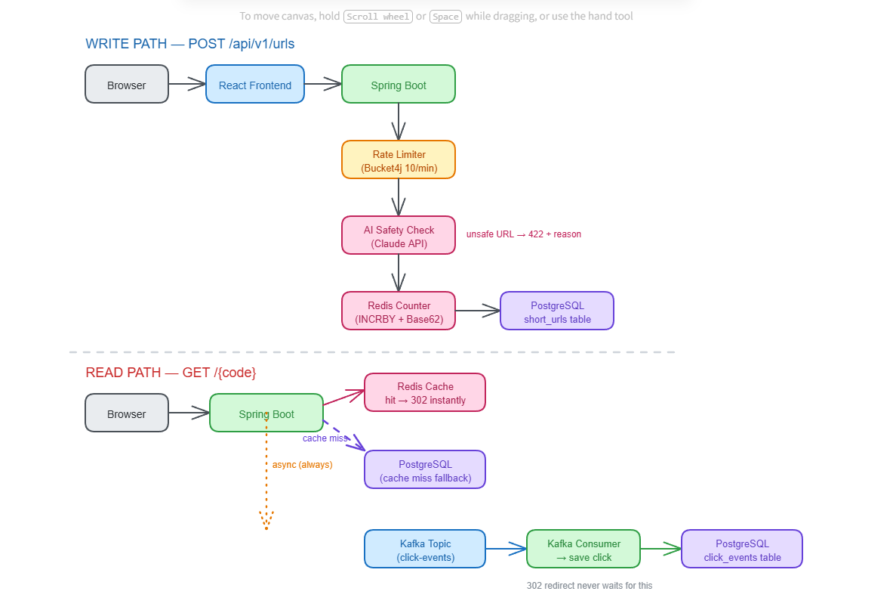

# URL Shortener

A production-grade URL shortener built with Java 17, Spring Boot 3, React 18, PostgreSQL, Redis, and Kafka.



## Demo

[](https://youtu.be/HalnY4AE9DI)

Click the thumbnail above to watch on YouTube. A local copy is also in the repo at [`Demo.mp4`](Demo.mp4) (downloadable; GitHub's inline preview only supports files under ~2MB, too small for the full walkthrough at watchable quality).

## Quick Start

### Prerequisites
- Docker Desktop (4GB+ RAM recommended)
- Docker Compose

### Run Everything

Open a terminal in the project root folder (where `docker-compose.yml` is), then run:

```bash
docker-compose up --build
```

Then open http://localhost in your browser.

| Service | URL |
|---|---|
| Frontend | http://localhost |
| Backend API | http://localhost:8080/api/v1 |
| Health Check | http://localhost:8080/actuator/health |
| Swagger UI | http://localhost:8080/swagger-ui.html |

### API Examples

**Shorten a URL:**
```bash
curl -X POST http://localhost:8080/api/v1/urls \
  -H "Content-Type: application/json" \
  -d '{"originalUrl": "https://www.example.com/very/long/path"}'
```

**Redirect:**
```bash
curl -L http://localhost:8080/{code}
```

**Get Analytics:**
```bash
curl http://localhost:8080/api/v1/analytics/{code}
```

**List all URLs:**
```bash
curl http://localhost:8080/api/v1/urls
```

**Delete a URL:**
```bash
curl -X DELETE http://localhost:8080/api/v1/urls/{code}
```

## Local Development (without Docker for the app)

Run infrastructure only via Docker, then run backend and frontend natively.

### Prerequisites
- Java 17+
- Maven 3.8+
- Node.js 18+
- Docker Desktop (for PostgreSQL, Redis, Kafka only)

### Step 1: Start infrastructure

From the project root folder:
```bash
docker-compose up postgres redis zookeeper kafka
```

### Step 2: Start backend

From the project root folder:
```bash
cd backend
mvn org.springframework.boot:spring-boot-maven-plugin:3.2.5:run
```

Backend runs at `http://localhost:8080`

### Step 3: Start frontend

From the project root folder:
```bash
cd frontend
npm install
npm run dev
```

Frontend runs at `http://localhost:5173`

### Step 4 (optional): Enable AI URL safety check

Set your Anthropic API key before starting the backend:

```bash
# Mac/Linux
export ANTHROPIC_API_KEY=sk-ant-...

# Windows PowerShell
$env:ANTHROPIC_API_KEY="sk-ant-..."
```

Without the key, the safety check is silently skipped; all other features still work normally.

### Swagger API Docs

Once the backend is running:
```
http://localhost:8080/swagger-ui.html
```

## Running Tests

From the project root folder:
```bash
cd backend
mvn verify
```
Runs unit tests (Surefire) and integration tests (Failsafe): 10 unit + 4 integration, all executing. Use `mvn test` for unit tests only.

## Documentation

Markdown sources live in `docs/`; the PDFs below are generated from them via `python docs/build_pdfs.py` (requires `pip install reportlab`) and are the reviewable deliverable set.

| Document | Source | Description |
|---|---|---|
| ARCHITECTURE.pdf | `docs/architecture.md` | Components, control flow, key decisions, data model, API surface |
| SCENARIO_1_GREENFIELD.pdf | `docs/scenario_1_greenfield.md` | Greenfield development approach |
| SCENARIO_2_BROWNFIELD.pdf | `docs/scenario_2_brownfield.md` | Brownfield integration of analytics, plus a live brownfield bug-fix case |
| SCENARIO_3_AMBIGUOUS.pdf | `docs/scenario_3_ambiguous.md` | Interpretation and decisions for an ambiguous requirement |
| AI_WORKFLOW.pdf | `docs/ai_workflow.md` | AI tool usage, spec-driven prompting, traceability, quality gates |
| RISKS_AND_TRADEOFFS.pdf | `docs/risks_and_tradeoffs.md` | Risk register and trade-off analysis |
| FINAL_ENGINEERING_SUMMARY.pdf | `docs/final_engineering_summary.md` | Full summary with rationale, artifacts, assumptions, limitations |
| `CLAUDE.md` | (repo root) | Project-level AI custom instructions / conventions |

## Project Structure

```
Charles/
├── backend/                          # Spring Boot 3 application
│   ├── src/main/java/com/schwab/urlshortener/
│   │   ├── api/
│   │   │   ├── controller/           # REST controllers
│   │   │   ├── dto/                  # Request/Response objects
│   │   │   └── exception/            # Exception types + global handler
│   │   ├── config/                   # Kafka, CORS, rate limiting
│   │   ├── domain/
│   │   │   ├── model/                # JPA entities
│   │   │   └── repository/           # Spring Data repositories
│   │   ├── kafka/                    # Producer + consumer
│   │   └── service/                  # Business logic
│   ├── src/main/resources/           # application.yml configs
│   ├── src/test/                     # Unit + integration tests
│   └── Dockerfile
├── frontend/                         # React 18 + TypeScript application
│   ├── src/
│   │   ├── api/client.ts             # Axios API layer
│   │   ├── pages/                    # Home, Manage, Analytics
│   │   ├── App.tsx
│   │   └── main.tsx
│   ├── Dockerfile
│   └── nginx.conf
├── docs/                              # Markdown sources for the PDFs below + build_pdfs.py
├── Demo.mp4                           # Demo walkthrough video
├── Architecture.png                  # Architecture diagram
├── docker-compose.yml
├── CLAUDE.md                         # AI custom instructions / project conventions
└── *.pdf                             # Documentation (generated from docs/*.md)
```
